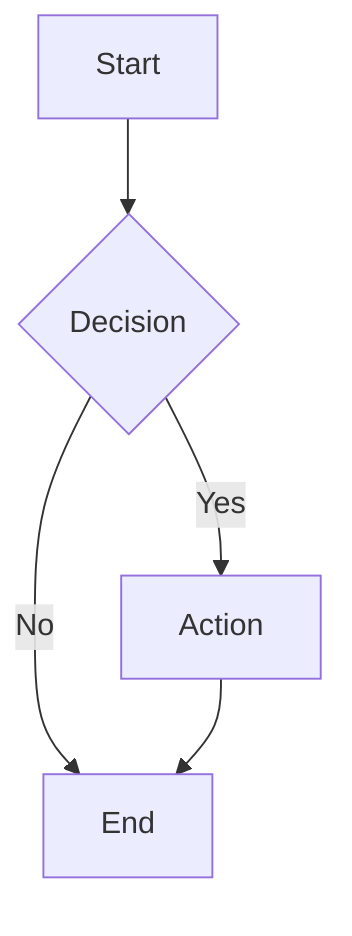
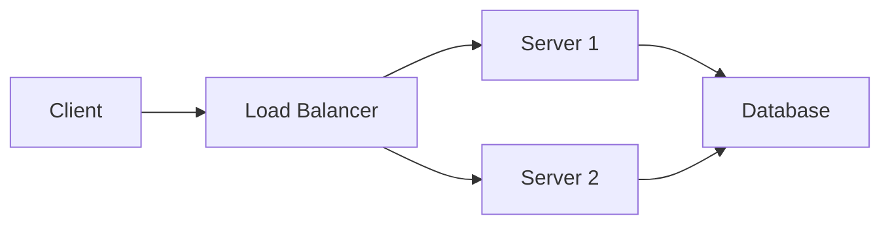
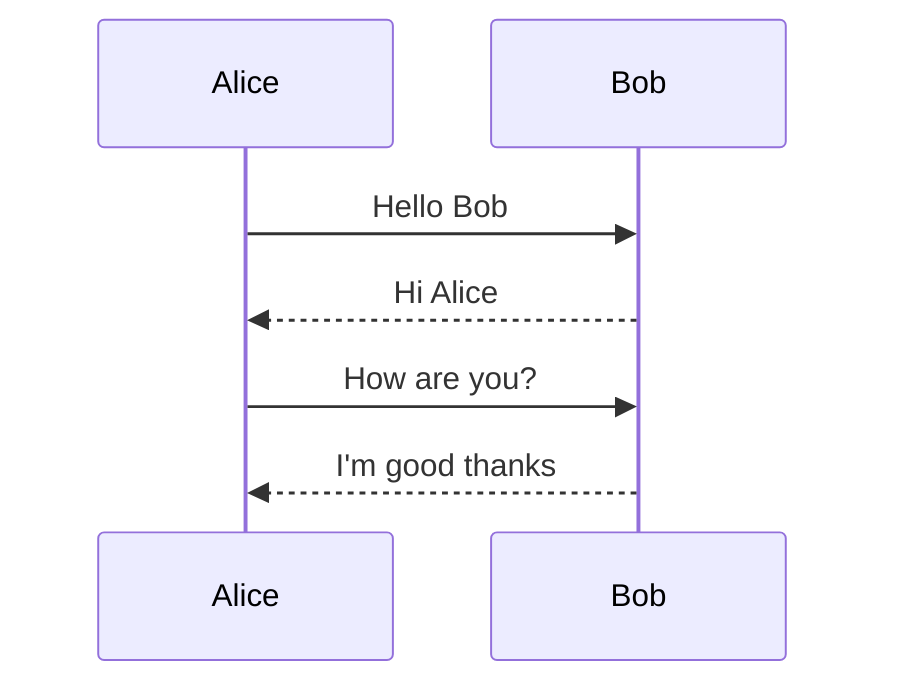
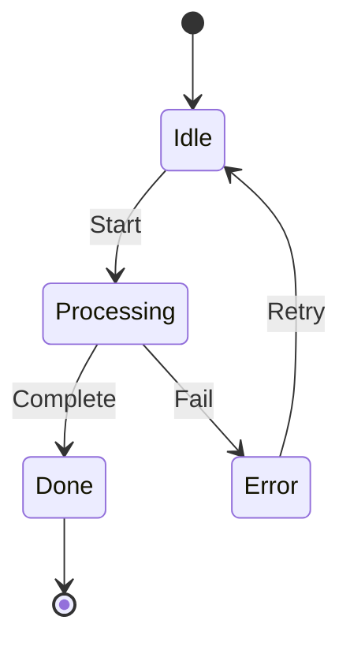
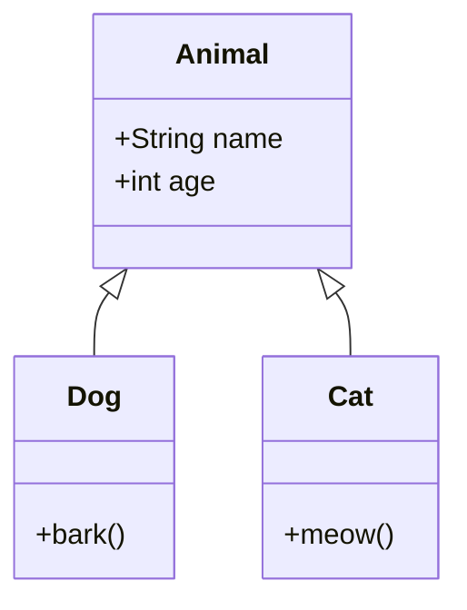
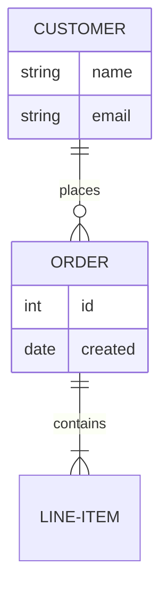

# Mermaid Diagram Test

## Flowchart (graph TD)



## Flowchart (graph LR)



## Sequence Diagram



## State Diagram



## Class Diagram



## ER Diagram



## Regular Code Block (should still highlight)

```javascript
function hello() {
    console.log("Hello, world!");
    return 42;
}
```
